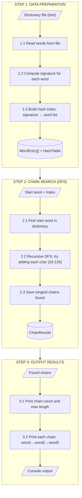
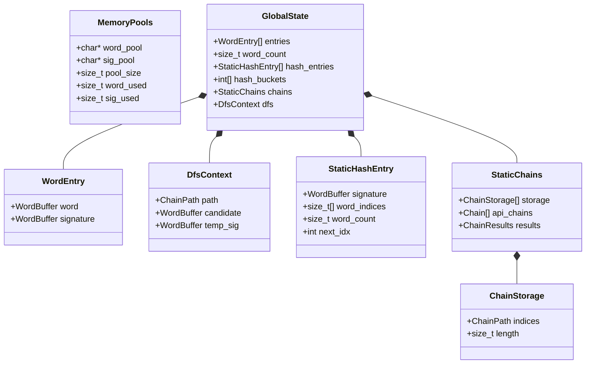
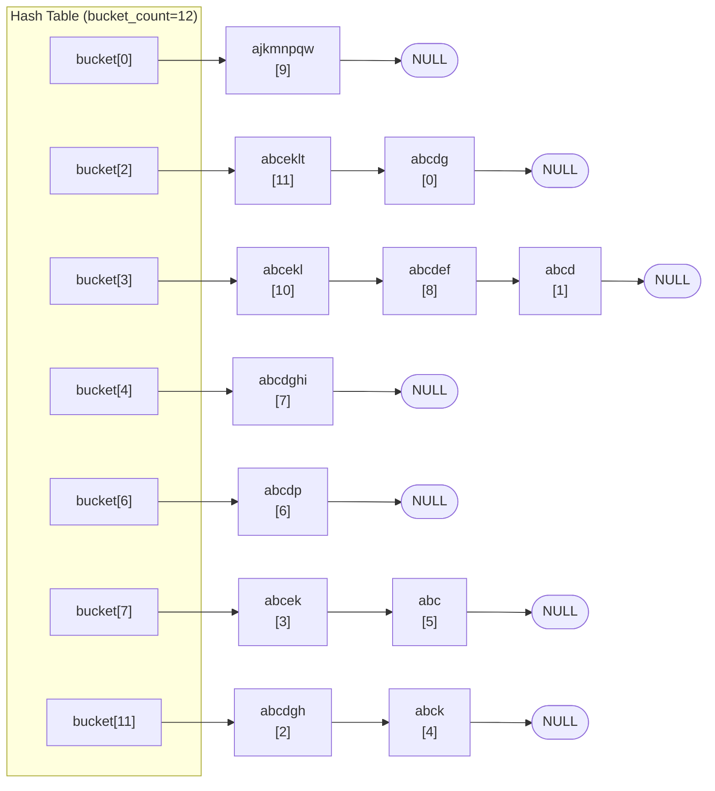
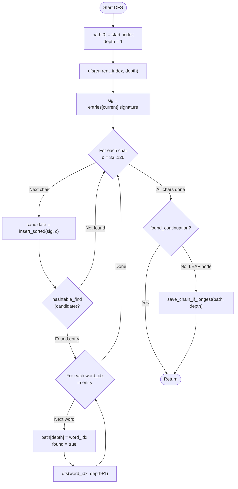

# Derived Anagram Chain Algorithm

## Problem Definition

**Derived anagram**: word B is a derived anagram of word A if B can be formed by adding exactly one letter to A and rearranging all letters.

**Example chain**: `abc → abck → abcek → abcelk → baclekt` (length 5)

**Input**: Dictionary file + start word  
**Output**: All longest chains starting from the start word

---

## Algorithm Overview



| Step | Input | Process | Output |
|------|-------|---------|--------|
| **STEP 1** | Dictionary file | Load → Signatures → Hash table | `entries[]` + `HashTable` |
| **STEP 2** | Index + start word | DFS search all paths | `ChainResults` |
| **STEP 3** | Found chains | Format and print | Console output |

---

## Data Structures



---

## STEP 1: Data Preparation

### 1.1 Dictionary Loading

```
entries[0].word  = "abcdg"      entries[0].signature  = "abcdg"
entries[1].word  = "abcd"       entries[1].signature  = "abcd"
..
entries[8].word  = "bafced"     entries[8].signature  = "abcdef"   (sorted)
entries[9].word  = "akjpqwmn"   entries[9].signature  = "ajkmnpqw" (sorted)
entries[10].word = "abcelk"     entries[10].signature = "abcekl"   (sorted)
entries[11].word = "baclekt"    entries[11].signature = "abceklt"  (sorted)
```

### 1.2 Signature Computation (Counting Sort)

```c
static void sort_chars(char *s, size_t len)
{
    int counts[CHAR_COUNT_SIZE] = {0};
    size_t i;
    size_t pos;
    int c;

    ASSERT_NOT_NULL(s);

    for (i = 0; i < len; i++)
    {
        ASSERT_MSG((unsigned char)s[i] < CHAR_COUNT_SIZE, "char out of range");
        counts[(unsigned char)s[i]]++;
    }

    pos = 0;
    for (c = 0; c < CHAR_COUNT_SIZE; c++)
    {
        while (counts[c]-- > 0)
        {
            s[pos++] = (char)c;
        }
    }
}
```

### 1.3 Hash Table



**FNV-1a Hash Function:**
```c
static unsigned long hash_fnv1a(const char *s)
{
    unsigned long h;

    ASSERT_NOT_NULL(s);

    h = FNV_OFFSET_BASIS;

    while (*s)
    {
        h ^= (unsigned char)*s++;
        h *= FNV_PRIME;
    }

    return h;
}
```

---

## STEP 2: DFS Chain Search



### DFS Trace Example (start: "abck")

```
dfs(4, depth=1) sig="abck"
│
├─ char='e' → candidate="abcek" → FOUND [3]
│  └─ dfs(3, depth=2) sig="abcek"
│     │
│     └─ char='l' → candidate="abcekl" → FOUND [10]
│        └─ dfs(10, depth=3) sig="abcekl"
│           │
│           └─ char='t' → candidate="abceklt" → FOUND [11]
│              └─ dfs(11, depth=4) sig="abceklt"
│                 │
│                 └─ No continuation found → LEAF
│                    Save chain: [4,3,10,11] length=4
│
└─ Result: "abck" → "abcek" → "abcelk" → "baclekt"
```

---

## Memory Modes

### Static Mode (Embedded)

```c
typedef struct {
    WordEntry entries[POOL_MAX_WORDS];
    StaticHashEntry hash_entries[POOL_MAX_HASH_ENTRIES];
    int hash_buckets[POOL_HASH_BUCKETS];
    StaticChains chains;
    DfsContext dfs;
} GlobalState;
```

### Dynamic Mode (PC)

```c
typedef struct {
    MemoryPools pools;
    Dictionary *dict;
    HashTable *ht;
    ChainResults *results;
    DfsContext dfs;
} GlobalState;
```

---

## Implementation Files

| File | Purpose |
|------|---------|
| `anagram_chain_core.c` | DFS, hash table, dictionary |
| `anagram_chain_io.c` | I/O, timers, validation |
| `config.h` | Memory pool constants |
| `global.h` | Type definitions |
| `trace.h` | Debug tracing |
| `assert.h` | Runtime checks |
| `anagram_chain.h` | Public API |
